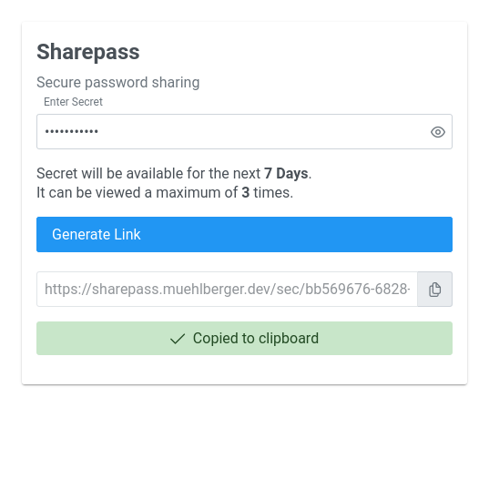
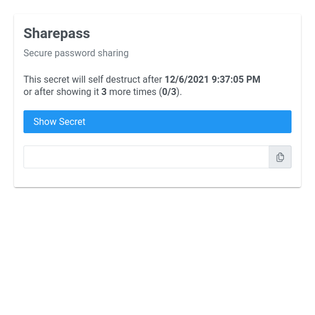

# SharePass - Secure password sharing utility

Sharepass allows simple and more secure sharing of passwors via an ecrypted and self-destructing link.

**Applications:**
- Want to share passwords via E-Mail or IM and not have the password persisted for ever in the chat history?

**Features:**

- End to end encryption
- Link expires after 7 days
- Link expires after showing the secret 3 times

**Security:**

- Secret is encrypted and decrypted only in the browser
- The encryption key is shared as part of the URL and never touches the Sharepass server
- Secure cryptography using the [Web Crypto API](https://developer.mozilla.org/en-US/docs/Web/API/Web_Crypto_API) of modern browsers
- Sharepass does not know the username or service this secret belongs to
- If the alternative is sending a password via E-Mail or IM in plain text this is definitely more secure

**Demo:**

https://sharepass.muehlberger.dev

Enter Secret | Show Secret
------------ | ------------
 | 

## Building

**Prerequisites:**

- Go 1.23+
- Node.js 14+
- NPM

**Steps:**
  
    cd web-ui
    npm install
    npm run build

    cd ..
    go generate
    go build

**SSL Dev Cert:**

Set up [mkcert](https://github.com/FiloSottile/mkcert) 

    cd web-ui
    mkcert localhost
